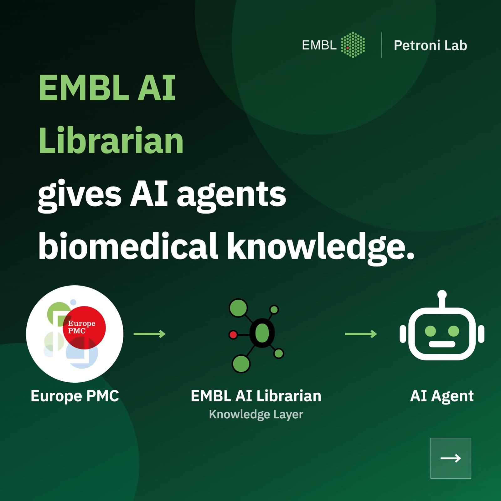
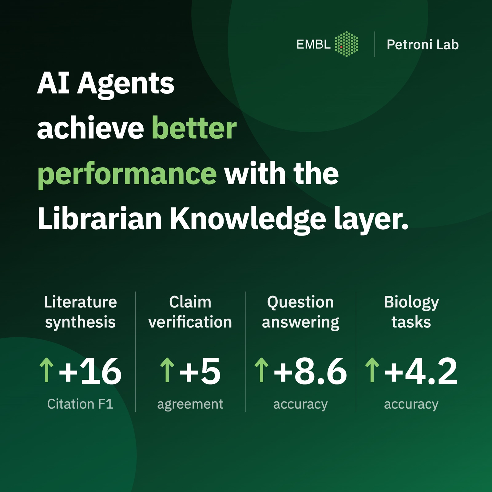

The web is increasingly accessed by AI agents rather than humans. Every agent needs knowledge, especially in the life sciences, where agentic pipelines are growing fast.

  
<strong>+16</strong>Citation F1 points on ScholarQABench over strong recent baselines

  
<strong>+8</strong>points for a GPT-5.4 agent on LitQA2, versus web search

  
<strong>40M+</strong>Europe PMC records, searched live with no reindexing

## The problem

Access to the literature is a crucial part of that need, and resources such as Europe PMC, with over 40M indexed records, are widely used to meet it. Yet these resources were not built for AI agents: they take keywords and complex syntax and return whole papers, so every agent must learn the syntax, issue several searches, and read full papers to find the evidence it needs.

## How Librarian works

EMBL AI Librarian is a knowledge layer that upgrades the Europe PMC interface for AI agents: **an agent asks in natural language and receives evidence that answers it.**

A single LLM orchestrates the whole knowledge retrieval process. It plans complementary subqueries executed by the live Europe PMC search engine, then reads the selected papers and locates the relevant evidence.

<figure>
  
  <figcaption>EMBL AI Librarian sits between Europe PMC and the agent, turning a keyword search engine into a natural-language knowledge layer.</figcaption>
</figure>

## Results

We evaluate Librarian across four benchmarks: literature synthesis, claim verification, open-domain question answering, and downstream biology tasks such as protocol questions and sequence manipulation.

- **Literature synthesis.** On ScholarQABench, Librarian improves Citation F1 by more than 16 points over strong recently published baselines.
- **Claim verification.** Used as the retrieval layer of an existing claim-verification pipeline, it increases agreement with expert consensus.
- **Open-form QA.** On LitQA2, a GPT-5.4 agent scores about 8 points higher when grounded in Librarian than with web search.

<figure>
  
  <figcaption>Agents equipped with Librarian improve across all four benchmarks: literature synthesis, claim verification, question answering, and biology tasks.</figcaption>
</figure>

Overall, equipping life-science agents with the Librarian knowledge layer improves performance across a range of tasks.

## Try it

The code is open: [github.com/petroni-lab/librarian](https://github.com/petroni-lab/librarian).
